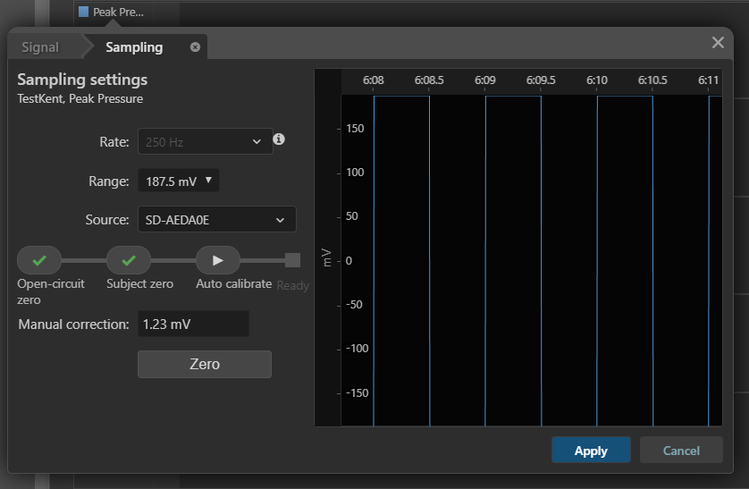

# LightningDeviceSDK Device UI

**The LightningDeviceSDK is currently under development and is subject to change.**

## Customizing Device UI

Below is an example of custom UI for setting up a signal's sampling in LabChart Lightning:



## Device UI Plugins

User Interface for Devices are customized via a plugin.

A Lightning device plugin is defined via a single Typescript (.ts) file located in a specific folder that LabChart Lightning knows to load files from.

Each LabChart Lightning device must export a single `getDeviceUIClasses()` function, e.g.

```ts
module.exports = {
   ...

   // Register custom device UI class.
   getDeviceUIClasses(libs) {
      return [new YourDeviceUI()];
   }
}
```

Similar to device class registration, LabChart Lightning calls `getDeviceUIClasses()` on startup. This must return an array of objects which Lightning will consider when showing device-related UI to the user.

On launch, LabChart Lightning loads all plugins. If there is a problem loading the plugin, information about the error can be obtained by clicking the (...) button highlighted in red in the image below:

### Device UI Class

```ts
export class YourDeviceUI implements IDeviceUIApi {
   // Identifier for this plugin class. Must be unique across all potential
   // device implementations known to LabChart Lightning.
   name = 'Your Device UI';

   // type is used by LabChart Lightning to identify this plugin class as
   // providing custom device UI.
   type: PluginFeatureTypes = 'Device UI';

   // Must exactly match the string returned from your device class's
   // getDeviceClassName() implementation.
   deviceClassName = 'YourDeviceClass';

   // Returns a description of the UI area to show for your device.
   describeStreamSettingsUI(
      settings: IDeviceStreamSettingsApi,
      deviceIndex: number,
      deviceManager: IDeviceManagerApi
   ): IUIAreaApi {
      ...
   }
}
```

### describeStreamSettingsUI()

Declares the UI to be shown to users when they access the signal sampling properties from the application.

This method is called only **once** upon display of the User Interface, not each time the user interacts with an element for example.

### Example
```ts
describeStreamSettingsUI(settings) {
      const elements = [];

      elements.push({
         type: 'header',
         title: 'Your device name',
         subtitle: 'Description of the signal'
      });

      // Shows a dropdown list of possible input gains.
      elements.push({
         type: 'setting',
         controlType: 'list',
         setting: settings.inputSettings.range
      });

      // Shows a live display of the sampling signal to the user.
      elements.push({
         type: 'signal-preview'
      });

      return {
         elements,
         layout: 'default',
         desiredWidthPixels: 500,
         desiredHeightPixels: 500
      } as IUIAreaApi;
   }
```

## More info

Interface definitions can be found within `public/device-ui-api.ts`.

These interfaces contain type annotations (in Typescript) and are usable in Typescript files. The import path must be relatively the same as in the examples as it is copied directly in-order to compile. E.g. Imports must always be from the path `../../public/device-api`
