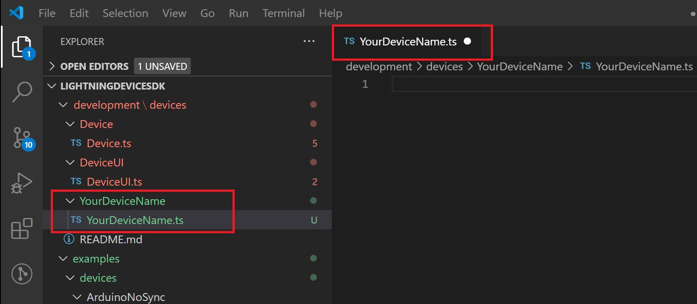
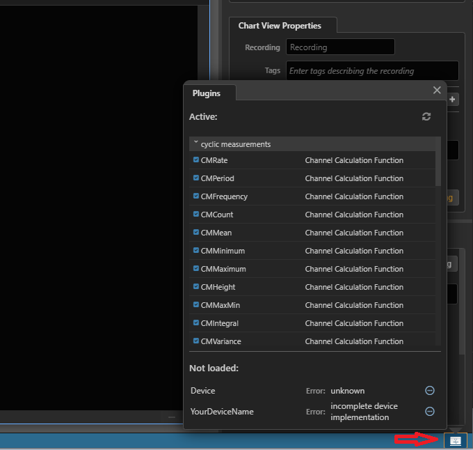
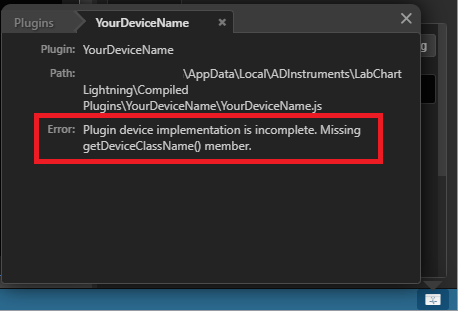
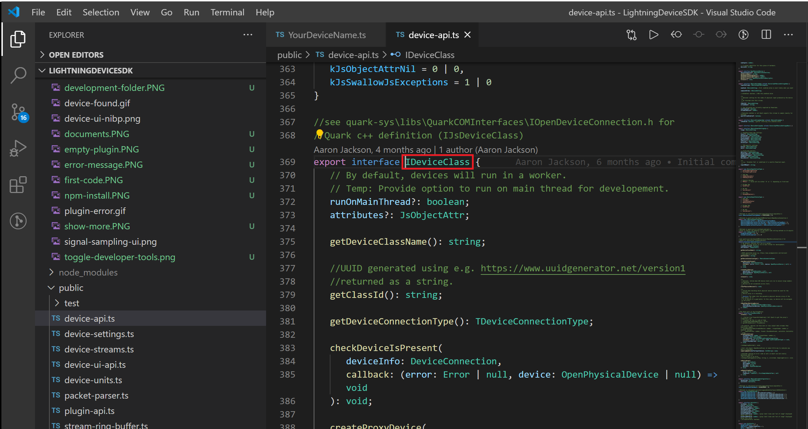

# Further Setup Checks and Familarization

Now is probably a good time to launch Lightning and the "devtools".

Once Lightning is running, you can use the help menu to toggle the developer tools:


You can then capture logging under the console tab.

As a setup check, we can now make a very simple (and very incomplete) plugin file.

First, let's create a file: `./development/devices/YourDeviceName/YourDeviceName.ts`



<br/>

The filename (excluding the file extension) much match the directory/folder name.

With `npm run watch` continuing to run in the terminal, we can check that a `.ts` file has been automatically generated in `Documents`


<br/>

Any device plugin file must implement a `DeviceClass`. You can find out more about this class in the example files, but essentially it represents all devices of a type or class. Lightning creates a list of these and compares them with those devices attached to a computer.

Paste the following into YourDevice.ts:

```ts
export class DeviceClass {

    constructor() {
        console.log('In the constructor');
    }

}

module.exports = {
    getDeviceClasses() {
       return [new DeviceClass()];
    }
};
```

<br/>

In VS Code it should look like this:


<br/>

If we reload Lightning, and have the dev tools open, we can see our log in the console:


<br/>


This means that the typescript compiler has generated a javascript (`.js`) file from our `.ts` file. It also means that this resultant `.js` file is now ready to be consumed in a final location:

`~\AppData\Local\ADInstruments\LabChart Lightning\Compiled Plugins` (Windows)

`~/Library/Application Support/ADInstruments/LabChart Lightning/Compiled Plugins` (Mac)

<br/>

Here is the Windows location:


<br/>

However, if we were to run Lightning and attempt to connect our device we would find that this plugin file is incomplete. We can find out more if we click on the `Manage plugins` button, which lives on the bottom-right of Lightning.



<br/>

We can see that `YourDeviceName` has an incomplete device implementation. We can further click on the `Show more` ellipsis button.


<br/>

A new tab appears with an error message:



<br/>

As you develop your plugin this will be a useful place to check for errors. However, as you make changes remember to reload Lightning.

In this case we see the message "Plugin device implementation is incomplete". Device Class must implement the IDeviceClass interface. In VS Code we will update our simple example by adding this interface to our class defintion. You can find this and other interfaces in [public/device-api.ts](public/device-api.ts):



<br/>

The next step then is to implement the `IDeviceClass` interface:

<br/>

```ts
import { IDeviceClass } from '../../../public/device-api';

export class DeviceClass implements IDeviceClass {

    constructor() {
        console.log('In the constructor');
    }
}

module.exports = {
    getDeviceClasses() {
       return [new DeviceClass()];
    }
};
```

<br/>

You can an auto generate an import statement with VS Code by placing your cursor on the green `DeviceClass` and using ctrl + space. However, please make sure the interface is being imported from `../../../public/device-api`, and not `public/device-api`.

In VS Code there are several ways to open this interface. Two options:
 - right click on `IDeviceClass` and then click on 'Go to definition' from the resulting context menu.
 - clicking `IDeviceClass` and then ctrl + left-click (command + left click on Mac).

There are many other device plugin requirements. [Here](OVERVIEW.md), you can learn about the structure of a device plugin file.  


**\*\*The LightningDeviceSDK is currently under development and is subject to change.\*\***

